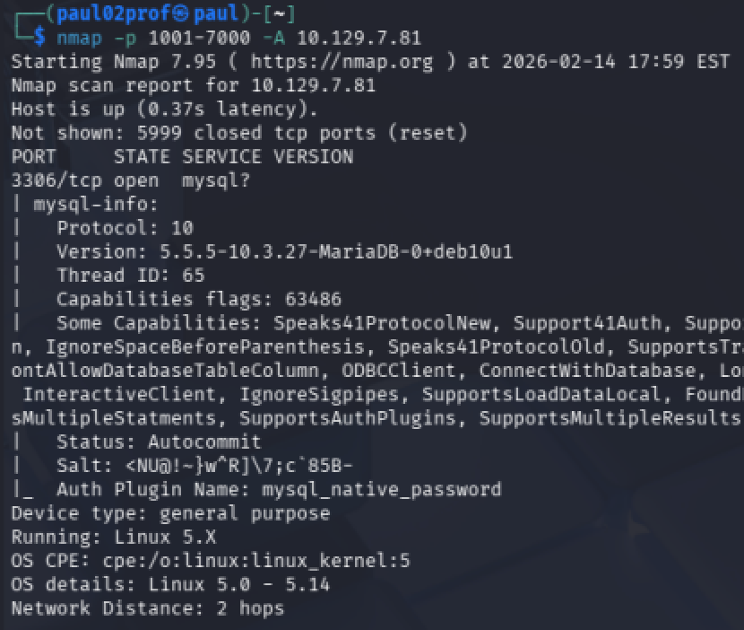
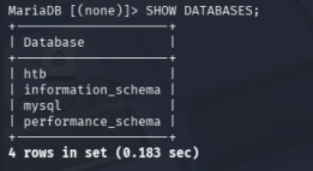
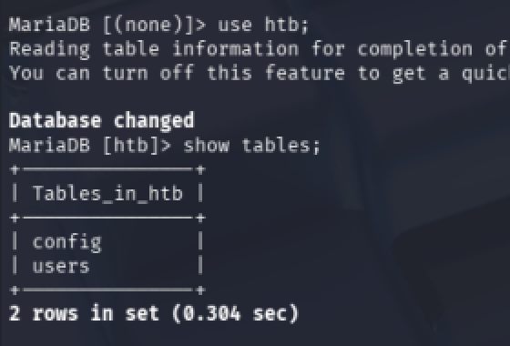
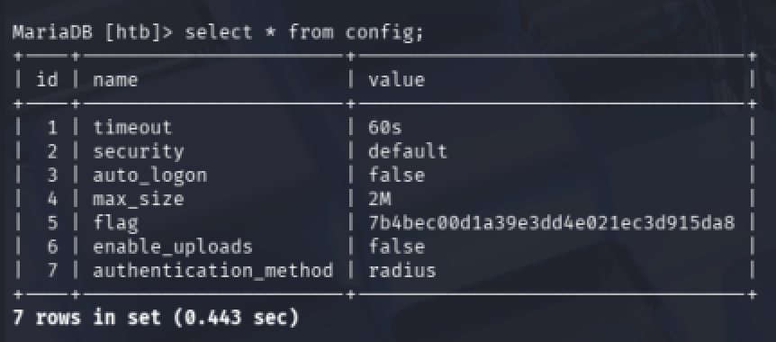

# HackTheBox - Sequel Writeup


---

## 📋 Informations Générales

| Élément | Détail                                                |
|---------|-------------------------------------------------------|
| Machine | Sequel    |
| Plateforme | Hack The Box                                          |
| Difficulté | Easy                                                  |
| OS | Linux                                                 |


---



### Task 1

```bash
3306
```
### Task 2

```bash
MariaDB
```

### Task 3

```bash
-u
```

### Task 4

```bash
root
```
### Task 5

```bash
*
```
### Task 6

```bash
;
```
---

### Lister les bases de donnees

### Task 7
```bash
htb
```
### Choisir la base de donnees et lister les tables

### Choisir afficher 


### Tag
```bash
7b4becc00d1a39e3dd4e021ec3d915da8
```